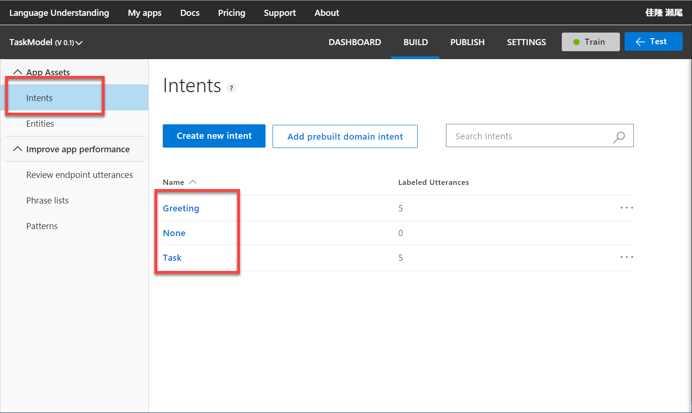
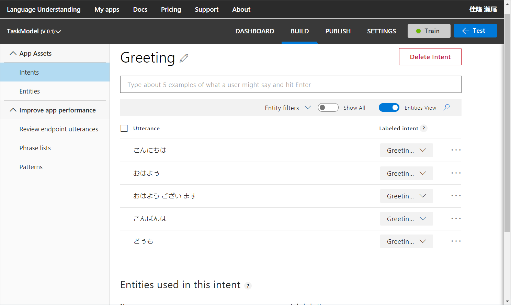
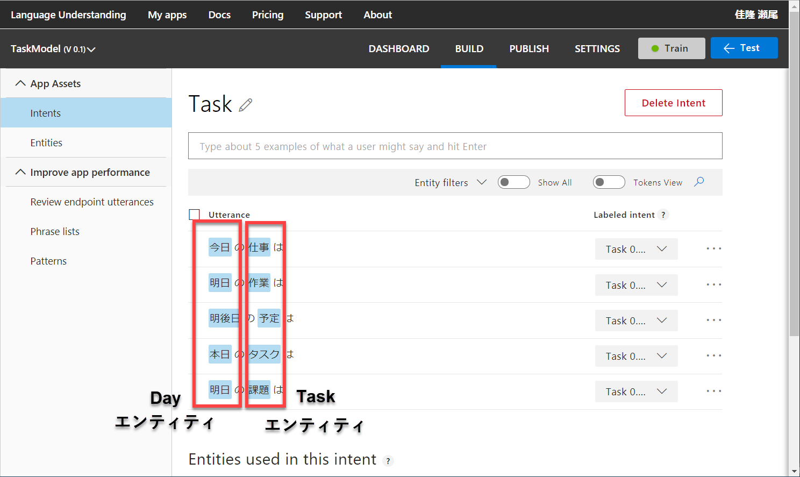
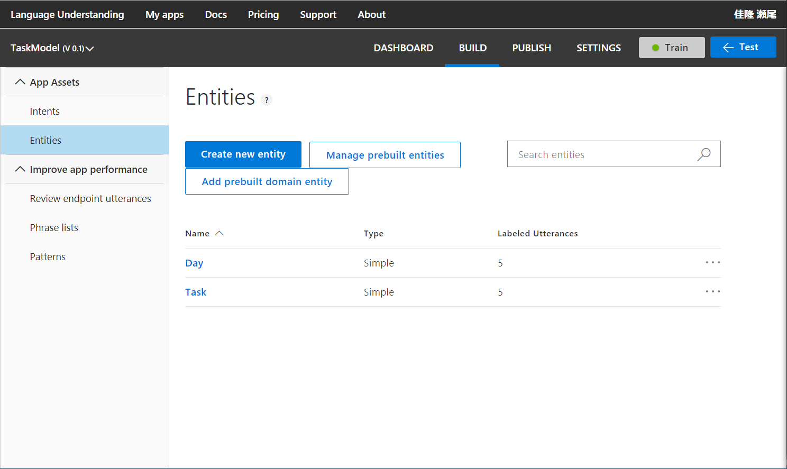

# 「Bot Buider V4 SDK デモ」アプリ （Cogbot 勉強会 #16 2018年8月28日開催）

このリポジトリは、**Cogbot 勉強会 #16** (2018年8月28日開催) のセッション

**「Bot Builder V4 SDK + QnA Maker / LUIS」**

のデモアプリのソースコードを集めたものです。

以下の 6個のソリューションを用意しました。

|ディレクトリ|利用するサービス|ソリューションの内容|
|---|---|---|
|[AnimalQna01](Demo/AnimalQna01)|QnA Maker|QnA Maker パッケージ利用のシンプルな例|
|[AnimalQna02](Demo/AnimalQna02)|QnA Maker|QnA Maker パッケージ利用の柔軟な例|
|[AnimalQnaRest01](Demo/AnimalQnaRest01)|QnA Maker|QnA Maker を REST 呼び出しする例|
|[TaskLuis01](Demo/TaskLuis01)|Langulage Understanding (LUIS)|LUIS パッケージ利用のシンプルな例|
|[TaskLuis02](Demo/TaskLuis02)|Langulage Understanding (LUIS)|LUIS パッケージ利用の柔軟な例|
|[TaskLuis03](Demo/TaskLuis03)|Langulage Understanding (LUIS)|TaskLuis02 のコードを整理したもの|

- AnimalQna で呼び出しているナレッジベースは、[**こちらの内容**](https://raw.githubusercontent.com/seosoft/BotBuilderV4_QnAMaker/master/SampleData/animal_qa.tsv) をインポートしたものです。ナレッジベースの作り方は [こちらのページ](https://github.com/seosoft/BotBuilderV4_QnAMaker/blob/master/03_QnaMaker.md) を参照してください。
- TaskLuis の Intent および Entity は以下を参考に、各自で [**LUIS ポータル**](https://luis.ai/) で作成してください。（リクエストがあれば LUIS のモデル作成手順を整理・・・するかもしれません）

---

## TaskLuis の作成例

1. **Intent** ・・・Greeting, Task を作成  
    

2. **Greeting** Intent  
    

3. **Task** Intent  
    

4. **Entity** ・・・Day, Task を作成  
    
